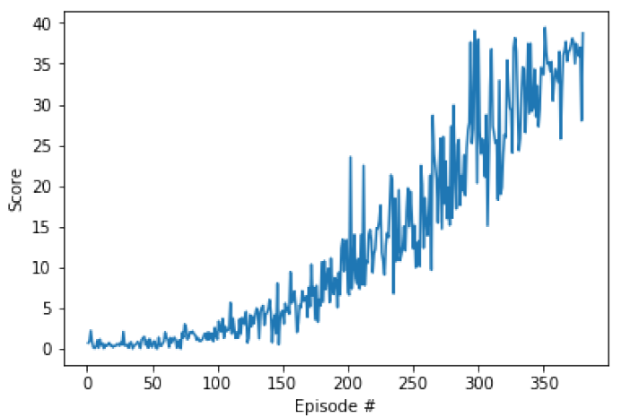

# Reinforcement Learning: Project 2: Continuous Control 
This is the DDPG project 2 for Udacity Reinforcement Learning Nano-degree.

## Description of environment
The environment is a [Unity]('https://github.com/Unity-Technologies/ml-agents/blob/main/docs/Learning-Environment-Examples.md#reacher') environment called "Reacher"
In this environment, a double-jointed arm can move to target locations. A reward of +0.1 is provided for each step that the agent's hand is in the goal location. Thus, the goal of your agent is to maintain its position at the target location for as many time steps as possible.

The observation space consists of 33 variables corresponding to position, rotation, velocity, and angular velocities of the arm. Each action is a vector with four numbers, corresponding to torque applicable to two joints. Every entry in the action vector should be a number between -1 and 1.

## "Solution"
To solve the environment, the agent must achieve an average score of > 30 over 100 consecutive episodes

## Framework used
I plan on using an Actor-critic DDPG model ("Deep Deterministic Policy Gradient")

## Starting point
I started off using the [DDPG pendulum]('https://github.com/udacity/deep-reinforcement-learning/tree/master/ddpg-pendulum') code from Udacity as a starting point

## Results
You can see the results in three ways:
1. Read Report.MD (although a lot of that report is also in this file)
1. Run the Jupyter notebook - 'Continous_control_2.ipynb'.
1. Read through the PDF of the completed Jupyter notebook - 'Continuous_control_2.pdf'

Note - if you do look through either the Jupyter notebook or the PDF, the 'solved versions' 
are right at the bottom. I kept in all the iterations of adjusting hyper-parameters 
to demonstrate the difficulty of hyper-parameter selection.

After many iterations through different hyperparameters, I completed the task.
Chart of moving average over 100 episodes is shown here:

## Notes on training
* The training took many iterations, cycling through different hyper-parameters
* Of particular sensitivity were the learning rates for the actor and the critic, and the amount of noise to add to exploration (oun_theta)

## Eventual hyper-parameter choices
The final hyper-parameters were as follows:
* Actor deep network - 2 fully connected layers of 256 then 128  
* Critic deep network - 2 fully connected layers of 256 then 128 
 - Critic network adds in the 4 actions before layer 2, to generate Q-values
* Replay buffer - memory of 1e6, batch size of 128
* gamma of 0.99
* tau of 0.001
* learning rates for both Actor and Critic of 3e-4
* learning every 5 steps
* did not use any weight decay
* Noise generation - mu of 0, sigma of 0.2, theta of 0.05

### Comments on solution hyper-parameters
* Note that there are easily 20+ hyper-parameters that you could 
choose from in the above list
* I did experiment with quite a few, and you can see these in the notebook and pdf
* Even small changes in some parameters had very big differences. For example, in the learning rates:
    * Using 8e-4 resulted in never getting a score >2
    *   Using 3e-4 resulted in the task being completed
* Even using the same hyper-parameters had different success rates at different times, e.g.
    * The hyper-parameters used which solved the task, did it in 380 epidsodes - yahoo!
    * However, I then tried to run the same model again, but with a higher target of 40.
        * This target was never hit.
        * The model still did 'solve' the problem, in that it hit > 30 by episode 1500.
        * So, excactly the same model, but took 4x as long as originally.
        * Which means there must remain a lot of 'luck' in initial starting conditions.
        * So, maybe some of the other hyper-parameter choices might have worked, if I had just run them again a few times?
    
### Store data
I kept the weights for the 'solution' models. These are called:
* checkpoint_actor_run8_SOLVED; and
* checkpoint_critic_run8_SOLVED

I also kept the scores data in a pickle file - 'run8_data_SOLVED.pkl'
    

